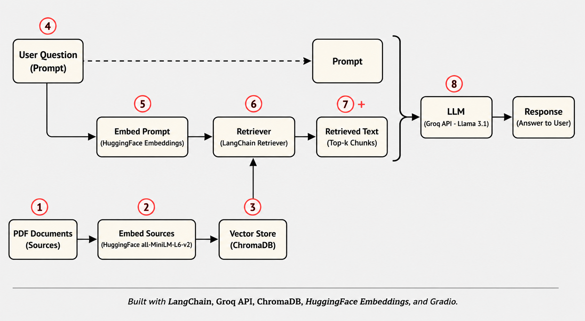
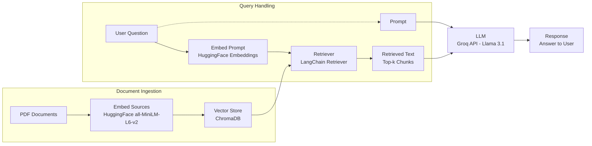

# PDF QA Bot

A conversational question-answering bot that reads PDF documents and answers user questions about their content, using a Retrieval-Augmented Generation (RAG) pipeline. Built to explore how document loading, text chunking, embeddings, vector search, and LLMs come together to build a real QA system — from raw PDF to grounded, conversational answers.

## Architecture





## Features

- **Multi-PDF Support**: Upload one or several PDFs and ask questions across all of them
- **Conversational Memory**: Remembers earlier questions in the same session, so follow-up questions work naturally
- **Semantic Retrieval**: Finds the most relevant chunks of text using vector similarity search, not just keyword matching
- **Fast Inference**: Powered by Groq's LLM API for low-latency responses
- **Interactive UI**: Simple, browser-based interface built with Gradio — no coding needed to use it
- **Error Handling**: Clear feedback for invalid files, empty PDFs, missing API keys, and failed queries

## Tech Stack

| Component | Technology |
|---|---|
| LLM | Groq API (Llama 3.1) |
| Embeddings | HuggingFace `sentence-transformers/all-MiniLM-L6-v2` |
| Vector Store | ChromaDB (in-memory) |
| Orchestration | LangChain |
| Document Loading | PyPDFLoader |
| UI | Gradio |

## Requirements

- Python 3.11
- A [Groq API key](https://console.groq.com/) (free to generate)

## Installation

1. Clone this repository:
   ```bash
   git clone https://github.com/yourusername/pdf-qa-bot-langchain-groq.git
   cd pdf-qa-bot-langchain-groq
   ```

2. Install the required dependencies:
   ```bash
   pip install -r requirements.txt
   ```

3. Set your Groq API key as an environment variable:

   **Windows (CMD):**
   ```bash
   set GROQ_API_KEY=your_actual_key_here
   ```

   **Windows (PowerShell):**
   ```powershell
   $env:GROQ_API_KEY="your_actual_key_here"
   ```

   **macOS/Linux:**
   ```bash
   export GROQ_API_KEY=your_actual_key_here
   ```

## How to Use

1. Run the app:
   ```bash
   python app.py
   ```

2. Open the local URL printed in the terminal (usually `http://127.0.0.1:7860`) in your browser.

3. Upload one or more PDF files using the upload box.

4. Once processing completes, type a question in the text box and press **Submit** (or hit Enter).

5. Ask follow-up questions — the bot remembers the conversation within the same session.

6. Upload new PDFs at any time to start a fresh conversation on different content.

## Project Structure

```
pdf-qa-bot-langchain-groq/
│
├── requirements.txt      # Pinned dependencies
├── qa_bot.py             # Backend pipeline: loading, splitting,
│                         # embeddings, vector store, retriever, QA chain
├── app.py                # Gradio interface: file upload, chat, and Q&A
└── assets/
    └── architecture-diagram.png
```

## How It Works

1. **Load** — Each uploaded PDF is read page by page using `PyPDFLoader`.
2. **Split** — Pages are broken into smaller overlapping text chunks using `RecursiveCharacterTextSplitter`, so the model can process them effectively.
3. **Embed** — Each chunk is converted into a vector representation using a HuggingFace sentence-transformer model.
4. **Store** — Vectors are stored in an in-memory ChromaDB vector store, isolated per session.
5. **Retrieve** — When a question is asked, it's embedded the same way, and the most similar chunks are pulled from the vector store.
6. **Generate** — The retrieved chunks, the question, and the chat history are sent to a Groq-hosted Llama 3.1 model, which generates a grounded, context-aware answer.

## Customization

You can adjust the following parameters directly in `qa_bot.py`:

- `chunk_size` / `chunk_overlap` in `split_documents()` — controls how text is broken up before embedding
- `k` in `create_retriever()` — controls how many chunks are retrieved per question
- `model_name` in `create_qa_chain()` — swap in a different Groq-hosted model (e.g., `llama-3.3-70b-versatile`)
- `model_name` in `get_embedding_model()` — use a different HuggingFace embedding model

## Future Enhancements

Potential improvements for future versions:

- Show retrieved source chunks alongside each answer
- Persist vector store to disk for reuse across sessions
- Add support for other file types (Word, TXT, web pages)
- Add a "clear conversation" button
- Deploy as a hosted web app

## License

This project is licensed under the MIT License — see the LICENSE file for details.

## Acknowledgments

- Built using [LangChain](https://www.langchain.com/), [Groq](https://groq.com/), [ChromaDB](https://www.trychroma.com/), [HuggingFace](https://huggingface.co/), and [Gradio](https://www.gradio.app/)
